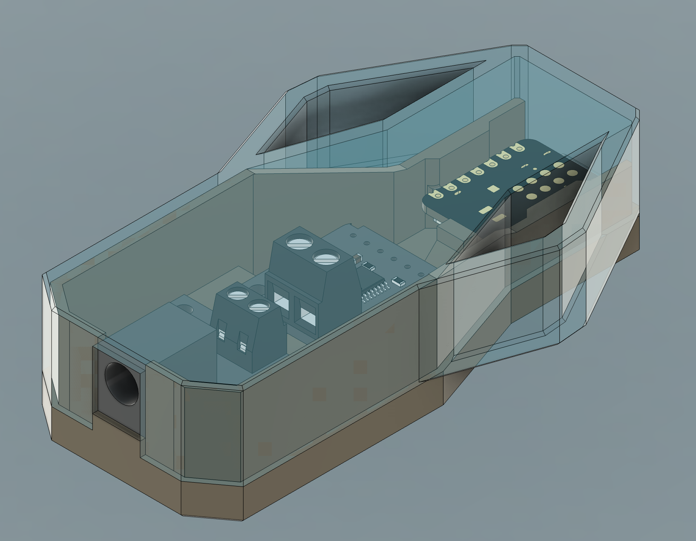

# 12V Battery Voltage Monitor v2.0

Monitors a 12V battery and reports voltage, SOC, and charge trending
to Home Assistant via MQTT. All calculations run on the ESP32 — no
Home Assistant configuration files needed. Sensors auto-discover
under one device via MQTT discovery.


## Repository layout

```
mqtt-battery-monitor/
├── src/        ← Arduino sketch + secrets.h template
├── docs/       ← Sensor reference and additional notes
├── assets/     ← Wiring diagram (SVG)
└── Hardware/   ← 3D printable case (STL) + render
```

## What it reports

| Sensor | Type | Description |
|--------|------|-------------|
| Battery Voltage | sensor | Volts from INA260 (3 decimal places) |
| Battery SOC | sensor | State of charge (%) from voltage lookup |
| Voltage Trend | sensor | Rate of change (V/hr, 30-min rolling) |
| Battery Trend | sensor | Label: Charging / Stable / Discharging |
| Battery Low | binary_sensor | ON when SOC drops below 20% |
| Battery Chemistry | select | Flooded / AGM / LiFePO4 (changeable from HA) |

Chemistry selection persists across reboots (saved to NVS flash).

## Hardware

| Component | Purpose |
|-----------|---------|
| [Seeed XIAO ESP32-C6](https://wiki.seeedstudio.com/xiao_esp32c6_getting_started/) | Microcontroller + WiFi |
| [Adafruit DC Power BFF](https://learn.adafruit.com/adafruit-dc-power-bff) | 12V → 5V buck converter, plugs under XIAO |
| [Adafruit INA260](https://learn.adafruit.com/adafruit-ina260-current-voltage-power-sensor-breakout) | I2C voltage sensor (0–36V) |
| 12V battery | Device under test |
| 2.1mm DC jack cable | Connects battery to BFF |

### Enclosure



STL files for the enclosure and cover are in [`Hardware/`](./Hardware):
[`Case.stl`](./Hardware/Case.stl) and [`Cover.stl`](./Hardware/Cover.stl).

## Wiring

### XIAO ESP32-C6 pin mapping

| Board silk | GPIO | Function |
|------------|------|----------|
| D0 | GPIO0 | — |
| D1 | GPIO1 | — |
| D2 | GPIO2 | — |
| D3 | GPIO21 | — |
| **D4** | **GPIO22** | **SDA (I2C data)** |
| **D5** | **GPIO23** | **SCL (I2C clock)** |
| D6 | GPIO16 | TX |
| D7 | GPIO17 | RX |
| D8 | GPIO19 | — |
| D9 | GPIO20 | — |
| D10 | GPIO18 | — |
| **3V3** | — | **3.3V output** |
| 5V | — | From BFF (internal) |
| GND | — | From BFF (internal) |
| LED | GPIO15 | On-board yellow LED |

**Note:** GPIO22/GPIO23 for I2C is specific to the XIAO ESP32-C6.
The older XIAO ESP32-C3 uses GPIO6/GPIO7. Do not mix them up.

### Connections (5 wires + jumper)

| From | To | Wire color |
|------|----|------------|
| Battery 12V | BFF 2.1mm DC jack | DC jack cable |
| BFF terminal block (+) | INA260 screw terminal Vin+ | 12V sense |
| BFF terminal block (−) | INA260 header GND | Ground |
| XIAO 3V3 | INA260 header Vcc | 3.3V logic power |
| XIAO D4 (GPIO22) | INA260 header SDA | I2C data |
| XIAO D5 (GPIO23) | INA260 header SCL | I2C clock |
| INA260 Vin+ | INA260 Vin- | **Jumper wire** |

See [`assets/battery_wiring_diagram_v2.svg`](./assets/battery_wiring_diagram_v2.svg) for the full wiring diagram.

### Voltage-only jumper

The INA260 has a 2mΩ internal shunt between Vin+ and Vin-. For
voltage-only monitoring (no current measurement), place a short
jumper wire between the Vin+ and Vin- screw terminals on the
INA260 breakout. This gives the shunt inputs a defined DC path
while allowing the chip to read bus voltage normally via the
on-board VBus connection (tied to Vin+ by default through the
VB jumper on the breakout PCB).

### INA260 breakout header pins (left to right)

| Pin | Connected | Notes |
|-----|-----------|-------|
| GND | Yes | Ground |
| Vcc | Yes | 3.3V from XIAO |
| SCL | Yes | I2C clock from D5 |
| SDA | Yes | I2C data from D4 |
| Alert | No | Not used |
| VBus | No | Tied to Vin+ on-board |
| Vin+ | No | Using screw terminal instead |
| Vin- | No | Using screw terminal instead |

### Power path

Battery 12V enters the BFF through the 2.1mm DC jack (on-board,
soldered to the BFF PCB). The BFF's MPM3610 buck converter steps
12V down to 5V and delivers it to the XIAO through the socket
headers. No external wiring between BFF and XIAO — the 5V and
GND connections are made through the socket pins. The BFF terminal
block provides a 12V pass-through to the INA260 for voltage sensing.

## Software setup

### Arduino IDE

1. **Add ESP32 board URL** in File → Preferences → Additional Board URLs:
   ```
   https://espressif.github.io/arduino-esp32/package_esp32_index.json
   ```

2. **Install board package**: Tools → Board Manager → search "XIAO esp32c6" → install

3. **Select board**: Tools → Board → esp32 → XIAO_ESP32C6

4. **Board settings**:
   - USB CDC On Boot: Enabled
   - CPU Frequency: 160MHz (WiFi)
   - Flash Size: 4MB
   - Partition Scheme: Default 4MB with spiffs (1.2MB APP/1.5MB SPIFFS)
   - Zigbee Mode: Disabled

5. **Install libraries** via Library Manager:
   - Adafruit INA260 Library (includes Adafruit BusIO)
   - PubSubClient by Nick O'Leary

6. **Edit `secrets.h`** with your WiFi SSID/password, MQTT broker IP,
   MQTT credentials, and OTA password

7. **Upload**: connect USB-C, select serial port, click Upload

### First boot

Open Serial Monitor at 115200 baud. You should see:

```
===================================
  Battery Voltage Monitor v2.0
  XIAO ESP32-C6 + INA260 + MQTT
  All sensors on-board
===================================
[NVS] Chemistry: Lead-Acid (Flooded)
[INA260] OK — 64x averaging, continuous
[INA260] I2C: SDA=GPIO22 (D4), SCL=GPIO23 (D5)
[WiFi] Connected — IP 192.168.x.x
[OTA] Ready on port 3232
[MQTT] connected
[MQTT] Discovery published (6 entities)
[READ] 12.847 V | SOC 95% | Trend 0.000 V/hr (Stable) | Lead-Acid (Flooded): OK
[MQTT] Publish → OK
```

### Home Assistant

No configuration needed. Once the ESP32 connects to your MQTT broker:

1. Go to Settings → Devices & Services → MQTT
2. A device called "Battery Monitor" appears with 6 entities
3. Add entities to any dashboard

To change battery chemistry, find the "Battery Chemistry" select
entity in HA and choose Flooded / AGM / LiFePO4. The ESP32 saves
the selection and recalculates SOC immediately.

## OTA updates

After the first USB flash, firmware updates go over WiFi.

### macOS firewall

OTA requires the ESP32 to connect *back* to your computer. If you
see "No response from device" after authentication succeeds:

- System Settings → Network → Firewall → allow python3
- Or temporarily disable the firewall during upload

### Serial Monitor

Serial Monitor only works over USB, not over the network port.
Once firmware is stable, debug output isn't needed — everything
is visible in Home Assistant via the MQTT entities.

## LED behavior

| LED state | Meaning |
|-----------|---------|
| Solid on | WiFi + MQTT connected, sensor OK |
| Blinking | Connecting to WiFi |
| Off | INA260 not found (check wiring) |
| Flashing during upload | OTA in progress |

## Sensor Calculations  (See docs/SENSOR.MD)

SOC is estimated via voltage-based piecewise linear interpolation
using open-circuit voltage tables for three battery chemistries:

| Chemistry | Nominal | 100% OCV | 0% OCV |
|-----------|---------|----------|--------|
| Lead-Acid (Flooded) | 12.6V | 12.73V | 11.31V |
| Lead-Acid (AGM) | 12.8V | 12.80V | 11.51V |
| LiFePO4 (4S) | 12.8V | 13.60V | 11.20V |

Accuracy is ±5–10% for lead-acid, ±10–15% for LiFePO4 (very
flat discharge curve). Most accurate when battery has been at
rest for 15–30 minutes.

## Voltage trending

The ESP32 maintains a 30-sample circular buffer (30 minutes at
60s intervals). Trend is calculated by comparing the average of
the oldest half against the newest half, converted to V/hr.

| Trend rate | Label |
|-----------|-------|
| > +0.1 V/hr | Charging fast |
| > +0.02 V/hr | Charging |
| < −0.1 V/hr | Discharging fast |
| < −0.02 V/hr | Discharging |
| otherwise | Stable |

The trend buffer fills gradually after boot — the first 2 minutes
show 0.000 V/hr until enough samples accumulate.

## Files

```
battery_monitor_mqtt/
├── battery_monitor_mqtt.ino   ← main sketch (all sensors on-board)
├── secrets.h                  ← WiFi, MQTT, OTA credentials
└── README.md
```

## Troubleshooting

| Problem | Fix |
|---------|-----|
| INA260 NOT FOUND | Check D4→SDA, D5→SCL, 3V3→Vcc, GND→GND. Verify address 0x40. |
| Wrong GPIO for I2C | XIAO ESP32-C6 uses GPIO22/23, NOT GPIO6/7 (that's the C3). |
| WiFi won't connect | 2.4 GHz only. Check SSID/password in secrets.h. |
| MQTT failed rc=-2 | Broker IP wrong or port 1883 blocked by firewall. |
| MQTT failed rc=5 | Wrong MQTT username or password. |
| OTA: No response | macOS firewall blocking return connection. Allow python3. |
| OTA: port error | Arduino IDE 2.x bug. Use espota.py command line instead. |
| Voltage reads 0 | Jumper Vin+ to Vin- on screw terminal. Check 12V at BFF terminal +. |
| SOC reads 0% | Select correct battery chemistry in HA. |
| Sensors not in HA | Check MQTT integration is active. Restart HA if needed. |

## Adding current monitoring later

To measure load current in the future:

1. Remove the jumper between Vin+ and Vin-
2. Wire Vin- to your load's positive terminal
3. Load current flows through the INA260's 2mΩ shunt
4. Add current and power MQTT discovery messages to the sketch
5. Current and power readings become non-zero

No hardware changes to the XIAO or BFF — only the INA260 wiring
and a firmware update.

## License

MIT
